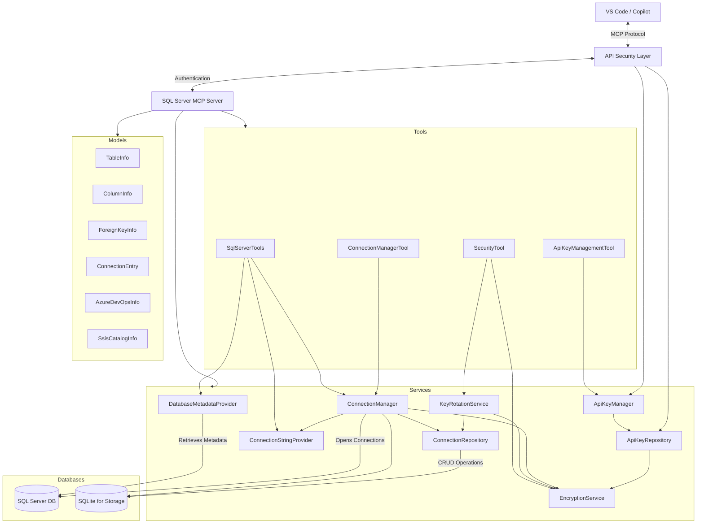
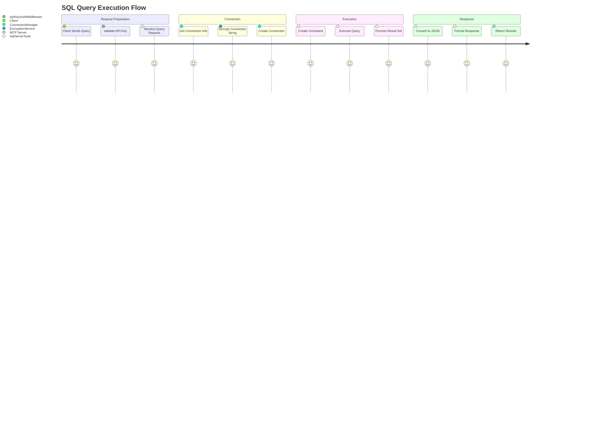
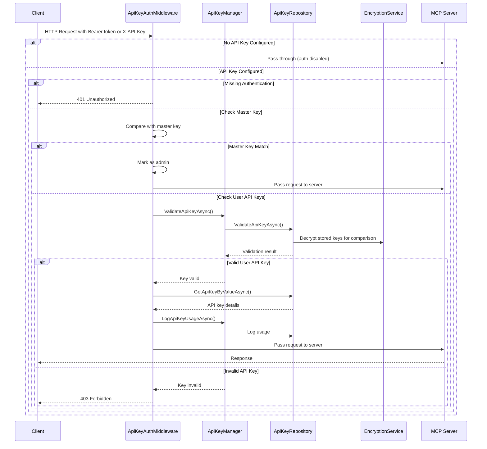
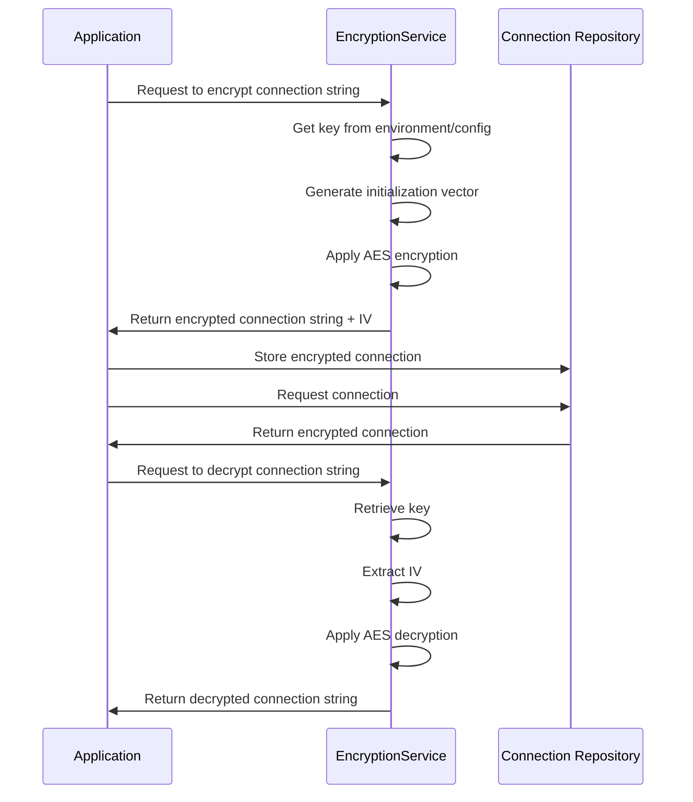
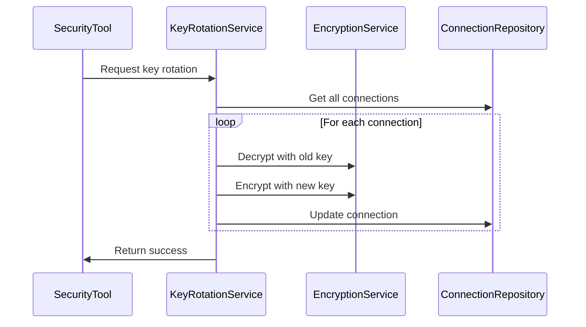
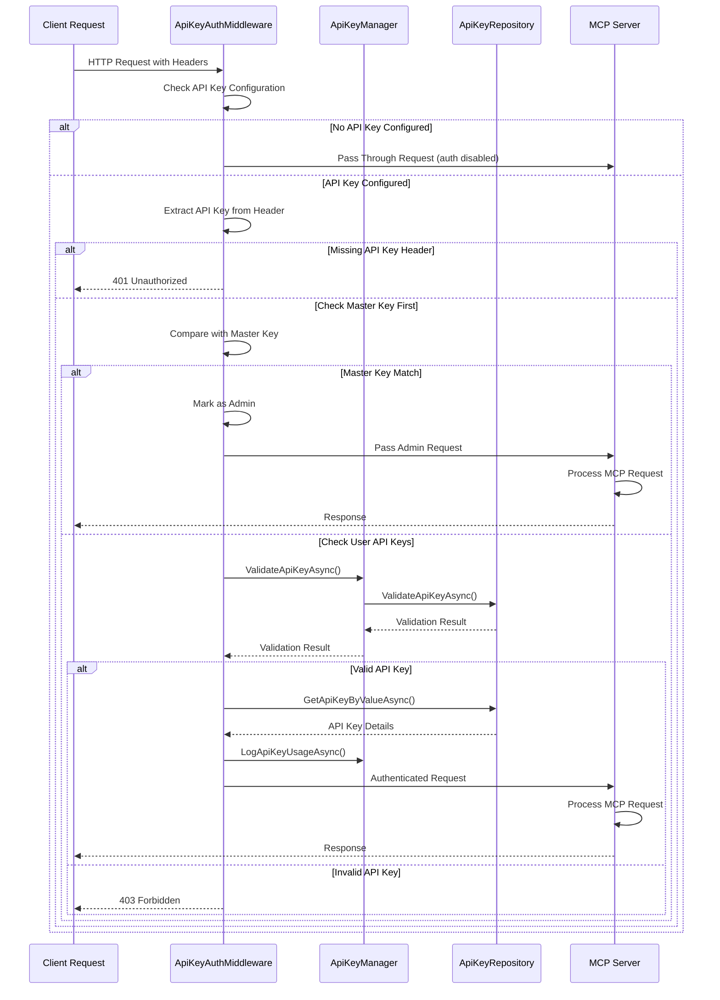
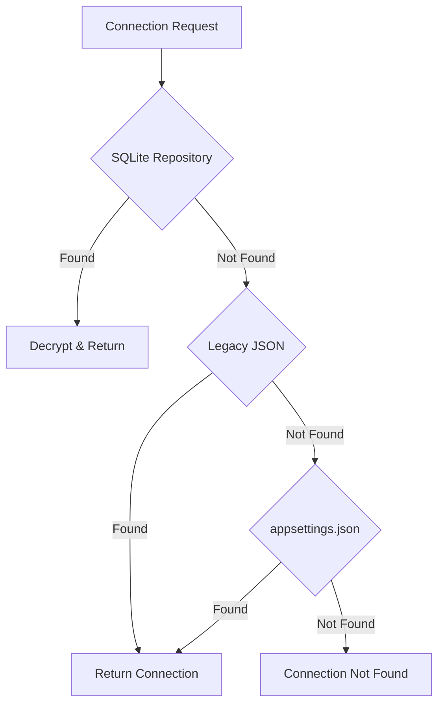
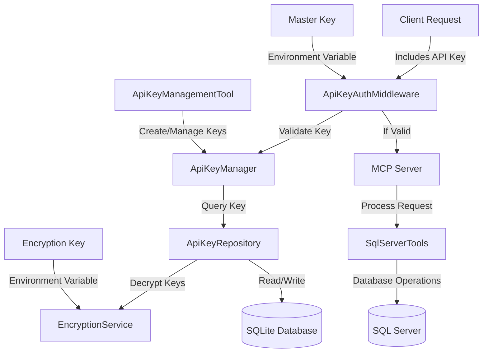
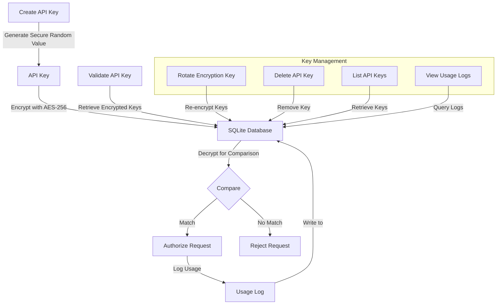

# SQL Server MCP Architecture

This document provides a comprehensive architectural overview of the SQL Server MCP (Model Context Protocol) Server, including component interactions, data flows, and implementation details.

## System Overview

The SQL Server MCP Server is a .NET-based application that implements the Model Context Protocol to provide SQL Server database connectivity for AI assistants like GitHub Copilot. The system enables retrieving metadata about database objects and executing SQL queries through a standardized protocol interface.

## Architecture Diagram

## Component Descriptions

### Client Layer

- **VS Code & Copilot**: Connects to the MCP server using HTTP transport and issues commands to interact with SQL databases.

### API Security Layer

- **Multi-Key Authentication System**: Supports both master API key and user-specific API keys for flexible authentication
- **API Key Authentication**: Validates API keys in request headers to secure access to the MCP server
- **ApiKeyAuthMiddleware**: Middleware component that enforces API key validation for each request
- **API Key Repository**: SQLite-based storage for encrypted API keys with usage tracking
- **Bearer Token Support**: Standard `Authorization: Bearer` header support along with `X-API-Key` header

### Server Core

- **MCP Server**: Provides the Model Context Protocol implementation with HTTP transport and comprehensive tool registration
- **Dependency Injection Container**: Manages component lifecycles and dependencies using Microsoft.Extensions.DependencyInjection
- **Logging**: Comprehensive structured logging using Serilog with file-based output and console logging for diagnostics
- **Middleware Pipeline**: API security middleware for request authentication and validation
- **HTTP Transport**: RESTful API endpoints with proper content negotiation and error handling

### Tools Layer

- **SqlServerTools**: Exposes MCP tool methods for SQL Server operations including:
  - Database metadata retrieval (tables, views, procedures, functions)
  - SQL query execution with JSON result formatting
  - Azure DevOps Analytics database queries
  - SSIS catalog information retrieval
  - SQL Server Agent job metadata and details
- **ConnectionManagerTool**: Manages database connection strings and connection information through MCP tools:
  - Add, update, remove, and list connections
  - Test connection validity
  - Retrieve connection metadata
- **SecurityTool**: Provides security operations through MCP tools:
  - Encryption key rotation
  - Migration of unencrypted connections to encrypted format
  - Secure key generation
- **ApiKeyManagementTool**: Manages API keys through MCP tools:
  - Create, list, revoke, and delete API keys
  - View API key usage logs
  - View user activity logs

### Services Layer

- **DatabaseMetadataProvider**: Core service that queries SQL Server system tables to retrieve metadata. Implemented as partial classes for specialized functionality:
  - **DatabaseMetadataProvider.cs**: Core metadata operations for tables, views, procedures, and functions
  - **DatabaseMetadataProvider.AzureDevOps.cs**: Azure DevOps Analytics database queries
  - **DatabaseMetadataProvider.Ssis.cs**: SSIS catalog metadata operations
  - **DatabaseMetadataProvider.Functions.cs**: SQL Server function-specific metadata
- **ConnectionManager**: Manages database connections, connection pooling, and connection lifecycle with fallback to legacy providers.
- **ConnectionRepository**: Persists connection information to SQLite database with full encryption support.
- **ConnectionStringProvider**: Retrieves connection strings from configuration files and legacy JSON storage.
- **EncryptionService**: Handles AES-256 encryption and decryption of sensitive connection data with PBKDF2 key derivation.
- **KeyRotationService**: Manages encryption key rotation and migration of unencrypted connections to encrypted format.
- **ApiKeyManager**: Core service for API key management and validation:
  - Supports both master key and user-specific API keys
  - Handles API key creation, validation, and revocation
  - API key usage tracking and logging
- **ApiKeyRepository**: Persists API key information in SQLite database with encryption support:
  - Stores encrypted API keys with associated metadata
  - Tracks API key usage for auditing and monitoring
  - Handles SQL queries for API key operations

### Models Layer

- **TableInfo**: Represents database objects (tables, views, procedures, functions).
- **ColumnInfo**: Represents columns and parameters with data types and constraints.
- **ForeignKeyInfo**: Represents foreign key relationships between tables.
- **ConnectionEntry**: Represents saved database connections with encryption support.
- **ApiKey**: Represents an API key with associated metadata:
  - Unique ID, name, and encrypted key value
  - User association and key type
  - Creation, expiration, and last used timestamps
  - Active status flag and description
- **ApiKeyUsageLog**: Tracks API key usage for monitoring and auditing:
  - API key ID, user ID, timestamp
  - Resource accessed, HTTP method
  - IP address and user agent information
- **AzureDevOpsInfo**: Contains Azure DevOps project, repository, and build information.
- **SsisCatalogInfo**: Represents SSIS catalog metadata including projects and packages.
- **SqlServerAgentJobInfo**: Contains SQL Server Agent job details and execution history.
- **Request/Response Models**: Structured models for all MCP tool operations (Add/Update/Remove/Test connections).

### Persistence Layer

- **SQL Server**: Target databases that the server connects to.
- **SQLite**: Local storage for connection information.

## Client Request Flow

The following diagram illustrates the typical flow of a client request through the system:

## Database Metadata Retrieval Flow

The following diagram shows the process of retrieving database metadata:

## Connection Management Flow

The following diagram illustrates how database connections are managed:

## SQL Query Execution Flow

This diagram shows the process of executing SQL queries:

## Key Technical Features

### Comprehensive Metadata

The system collects detailed metadata about:

- **Tables and Views**: Complete schema information with columns, data types, constraints, primary keys, and foreign keys
- **Stored Procedures**: Parameter information, return types, and complete SQL definitions
- **SQL Functions**: Input parameters, return types, function types (scalar, table-valued), and SQL code
- **Azure DevOps Analytics**: Projects, repositories, build definitions, work items, and release pipelines
- **SSIS Catalog**: Folders, projects, packages with deployment models and execution history
- **SQL Server Agent Jobs**: Job definitions, steps, schedules, execution history, and job categories

### Connection Management

- **Dual Storage System**: SQLite database for new encrypted connections with fallback to legacy JSON configuration
- **AES-256 Encryption**: Connection string encryption with PBKDF2 key derivation (10,000 iterations)
- **Environment Variable Override**: `MSSQL_MCP_DATA` environment variable for custom data directory location
- **Connection Testing and Validation**: Automatic connection verification before storage
- **Connection Pooling**: Performance optimization for database connections
- **Migration Support**: Automated migration from unencrypted to encrypted connection strings
- **Key Rotation**: Secure rotation of encryption keys with re-encryption of all stored connections
- **Last Used Tracking**: Automatic timestamp updates for connection usage analytics

### API Security

- **Bearer Token Authentication**: Standard Bearer token authentication using the Authorization header
- **ApiKeyAuthMiddleware**: Comprehensive middleware component that enforces Bearer token validation
- **Environment Variable Support**: Secure key storage in `MSSQL_MCP_API_KEY` environment variable
- **Proper HTTP Status Codes**: 401 Unauthorized for missing/malformed tokens, 403 Forbidden for invalid tokens
- **Optional Authentication**: Supports disabling authentication when no key is configured for development scenarios
- **Industry Standard**: Uses standard Bearer token format following RFC 6750

### Robust Error Handling

- **Comprehensive Logging**: Detailed error logging using Serilog with structured logging
- **Client-Friendly Messages**: Sanitized error messages returned to clients while maintaining detailed internal logs
- **Multiple Timeout Controls**: Command timeouts, connection timeouts, and operation timeouts
- **SQL Error Analysis**: Specific handling for SQL Server error conditions and connection issues
- **Proper HTTP Status Codes**: Appropriate status codes for different error types (401, 403, 500, etc.)
- **Graceful Degradation**: Fallback mechanisms for connection and metadata retrieval failures

### Performance Considerations

- **Asynchronous Operations**: Full async/await pattern implementation throughout the entire codebase
- **Connection Pooling**: Efficient database connection management and reuse
- **Configurable Timeouts**: Command timeout controls (default 30 seconds) for long-running operations
- **Cancellation Support**: CancellationToken support for graceful operation cancellation
- **Content Type Negotiation**: Efficient JSON serialization and HTTP content handling
- **Lazy Loading**: On-demand metadata loading to reduce unnecessary database queries
- **Resource Disposal**: Proper resource management with using statements and IDisposable implementation

## Security Features

### Multi-Key API Authentication

### Connection String Encryption

### Key Rotation

## Specialized Database Metadata Providers

The `DatabaseMetadataProvider` is implemented as a partial class system to handle different types of SQL Server metadata:

### Core Database Metadata (DatabaseMetadataProvider.cs)

- **Table and View Schema**: Complete metadata including columns, data types, constraints
- **Primary and Foreign Keys**: Relationship mapping and constraint information
- **Stored Procedures**: Parameter definitions and SQL code extraction
- **User-Defined Functions**: Scalar and table-valued function metadata

### Azure DevOps Analytics (DatabaseMetadataProvider.AzureDevOps.cs)

- **Project Information**: DevOps projects with process templates and creation dates
- **Repository Metadata**: Git repositories, sizes, branch information
- **Build Definitions**: Build pipeline configurations and execution counts
- **Work Item Tracking**: Work item counts and project statistics

### SSIS Integration Services (DatabaseMetadataProvider.Ssis.cs)

- **SSIS Catalog**: Complete SSISDB catalog structure
- **Project Deployment Model**: Project-based deployment information
- **Package Metadata**: SSIS package definitions and execution history
- **Folder Organization**: SSIS folder structure and project grouping

### SQL Functions (DatabaseMetadataProvider.Functions.cs)

- **Function Types**: Scalar, inline table-valued, and multi-statement functions
- **Parameter Information**: Input parameters with data types
- **Return Type Definitions**: Function return specifications
- **SQL Code Extraction**: Complete function definition retrieval

## Middleware Architecture

### Multi-Key Authentication Middleware

The `ApiKeyAuthMiddleware` provides comprehensive request authentication with support for both master and user-specific API keys:

### Middleware Features

- **Configurable Header Name**: Default `X-API-Key` with override capability
- **Environment Variable Integration**: `MSSQL_MCP_API_KEY` support
- **Development Mode**: Automatic authentication bypass when no key is configured
- **Comprehensive Logging**: Request authentication attempts and failures
- **Proper HTTP Status Codes**: Standards-compliant error responses

## Configuration Management

### Configuration System

The system uses a multi-layered configuration approach:

1. **appsettings.json**: Base application configuration including logging, MCP server settings, and default connection strings
2. **appsettings.Development.json**: Development-specific overrides for debugging and testing
3. **Environment Variables**: Secure configuration for sensitive data:
   - `MSSQL_MCP_KEY`: Encryption key for connection string protection
   - `MSSQL_MCP_API_KEY`: API authentication key
   - `MSSQL_MCP_DATA`: Custom data directory location override
4. **SQLite Database**: Runtime storage for encrypted connection strings
5. **Legacy JSON Support**: Backward compatibility with `connections.json` files

### ConnectionStringProvider

The `ConnectionStringProvider` implements a fallback system:

## Testing and Quality Assurance

### Comprehensive Test Suite

The project includes extensive testing infrastructure:

- **Unit Tests**: Complete coverage of services, encryption, key rotation, and connection management
- **Integration Tests**: End-to-end testing of MCP tool operations
- **Security Tests**: Validation of encryption, decryption, and key rotation functionality
- **Mock Testing**: Comprehensive mocking of external dependencies

### PowerShell Management Scripts

Administrative and testing scripts located in the `Scripts/` folder:

- **Assess-Connection-Security.ps1**: Security assessment and validation
- **Migrate-To-Encrypted.ps1**: Migration utility for legacy connections
- **Rotate-Encryption-Key.ps1**: Secure key rotation operations
- **Set-Api-Key.ps1**: API key configuration management
- **Test-Security-Features.ps1**: Security feature validation
- **Verify-Encryption-Status.ps1**: Connection encryption status verification

## Extension Points

The architecture supports the following extension points:

1. **Additional Database Providers**

   - The system can be extended to support other databases by implementing new tool and provider classes

2. **Enhanced Metadata**

   - Additional metadata can be collected by extending the models and provider methods

3. **Additional MCP Tools**

   - New tool classes can be registered to extend functionality

4. **Authentication Mechanisms**

   - Additional authentication methods beyond API keys could be added
   - Role-based access control (RBAC) could be integrated with the existing multi-key authentication
   - OAuth or OpenID Connect support could be added for enterprise identity providers

5. **Additional Security Features**
   - New encryption algorithms can be implemented through the IEncryptionService interface
   - Advanced key management solutions can be integrated

## Security Considerations

1. **Connection String Security**

   - Connection strings are stored encrypted in a local SQLite database
   - AES encryption is used to protect sensitive information
   - Encryption keys can be rotated periodically for enhanced security

2. **API Access Control**

   - Multi-key API authentication system with both master and user-specific keys
   - Keys are stored encrypted in SQLite with AES-256 encryption
   - Comprehensive API key lifecycle management, including creation, revocation, and deletion
   - Usage logging for security monitoring and audit trails
   - Support for key expiration and key types (user, service, admin)

3. **SQL Injection Prevention**

   - Parameterized queries are used throughout the codebase
   - User input validation
   - Proper error handling and logging

4. **Error Information**
   - Error details are logged but sanitized before returning to clients
   - HTTP status codes provide appropriate error categorization
   - Authentication failures are properly handled with 401/403 responses

## Deployment and Operations

### Docker Support

The system includes comprehensive Docker support:

- **Dockerfile**: Multi-stage build with optimized .NET 8 runtime
- **Docker Compose**: Complete deployment configuration
- **Environment Configuration**: Containerized environment variable management
- **Volume Mounting**: Persistent data storage for connections and logs

### Logging and Monitoring

- **Structured Logging**: Serilog with JSON output format
- **File-based Logging**: Daily log rotation with configurable retention
- **Console Logging**: Development and debugging support
- **Performance Metrics**: Connection pooling and query execution timing

## Configuration

The system uses a comprehensive configuration management approach:

1. **appsettings.json**

   - Base application settings and logging configuration
   - Default connection strings and MCP server settings
   - HTTP transport and middleware configuration

2. **appsettings.Development.json**

   - Development-specific overrides
   - Enhanced logging for debugging
   - Local development connection strings

3. **Environment Variables**

   - `MSSQL_MCP_KEY`: AES encryption key for connection string protection
   - `MSSQL_MCP_API_KEY`: API authentication key for secure access
   - `MSSQL_MCP_DATA`: Custom data directory location override

4. **SQLite Database**

   - Encrypted connection string storage with AES-256
   - Connection metadata and usage tracking
   - Automatic database initialization and schema management

5. **PowerShell Scripts**
   - Administrative utilities for key management and security operations
   - Automated migration and encryption tools
   - Security assessment and validation scripts

## Conclusion

The SQL Server MCP Server provides a comprehensive and production-ready implementation of the Model Context Protocol for SQL Server databases. The architecture successfully addresses the complexities of database connectivity, security, and metadata management while maintaining the flexibility and extensibility required for integration with AI assistants like GitHub Copilot.

### Key Architectural Strengths

1. **Modular Design**: Clean separation of concerns with well-defined interfaces and dependency injection
2. **Security-First Approach**: Multi-layered security with API authentication, AES-256 encryption, and key rotation
3. **Comprehensive Metadata Support**: Specialized providers for standard databases, Azure DevOps, SSIS, and SQL Server Agent
4. **Robust Connection Management**: Dual storage system with fallback support and automated migration capabilities
5. **Production Ready**: Docker support, comprehensive logging, error handling, and configuration management

### Technical Excellence

- **Asynchronous Programming**: Full async/await implementation for optimal performance
- **Resource Management**: Proper disposal patterns and connection pooling
- **Error Handling**: Graceful degradation with comprehensive logging and client-friendly error messages
- **Testing**: Extensive unit and integration test coverage with mock support
- **Documentation**: Complete architectural documentation and operational guides

### Extensibility and Future Growth

The layered architecture and interface-based design enable:

- Addition of new database providers and metadata extractors
- Enhanced security mechanisms and authentication providers
- Extended MCP tool capabilities and specialized metadata collection
- Integration with additional Microsoft SQL Server ecosystem components

This implementation demonstrates how the Model Context Protocol can be effectively used to bridge AI assistants with complex enterprise database systems while maintaining security, performance, and operational excellence standards.

## API Key Management Flow

The following diagram illustrates the API key management lifecycle:

## API Key Data Flow

This diagram shows how API key data is stored and accessed:

### API Key Storage and Encryption

API keys are securely stored and managed using the following approach:

1. **Key Generation**: Strong random generation of API keys using cryptographically secure RNG
2. **Encryption**: Keys are encrypted with AES-256 before storage
3. **Secure Storage**: Encrypted keys stored in SQLite database
4. **Validation Flow**: When validating, stored keys are decrypted and compared securely
5. **Usage Tracking**: All key usages are logged for audit and monitoring
6. **Key Types**: Support for different key types (admin, user, service, etc.)
7. **Key Expiration**: Support for time-limited keys with automatic expiration
