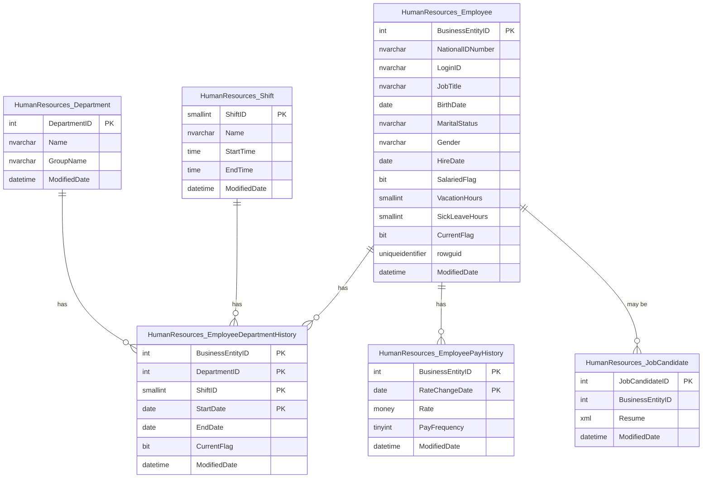
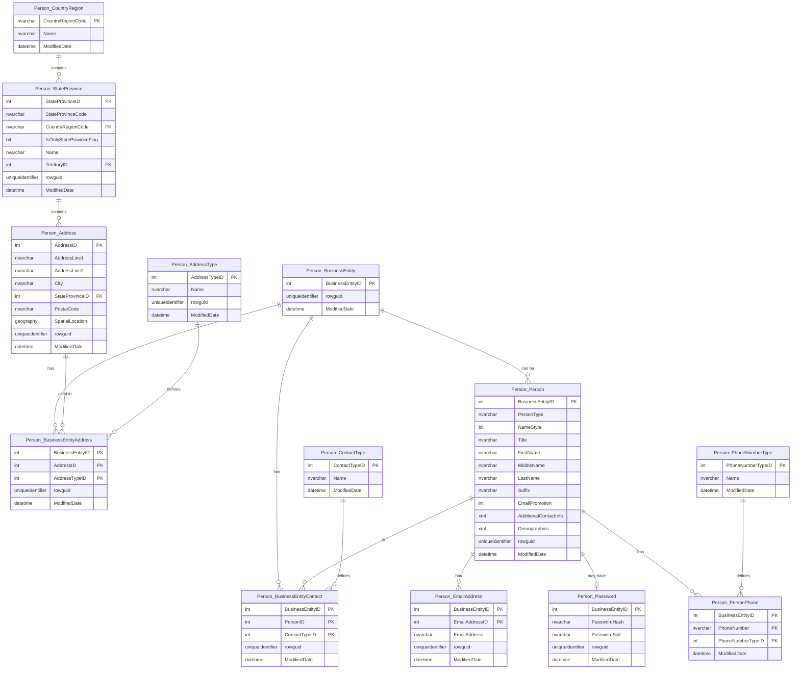
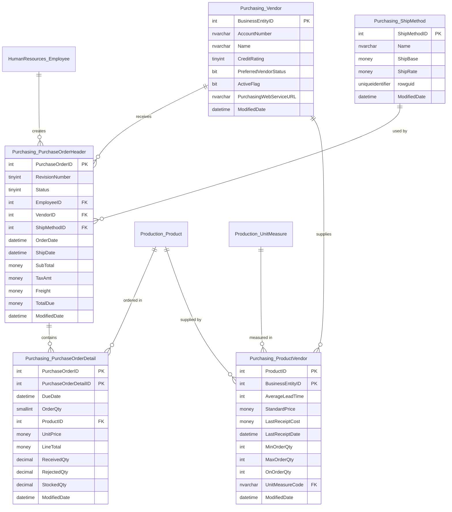
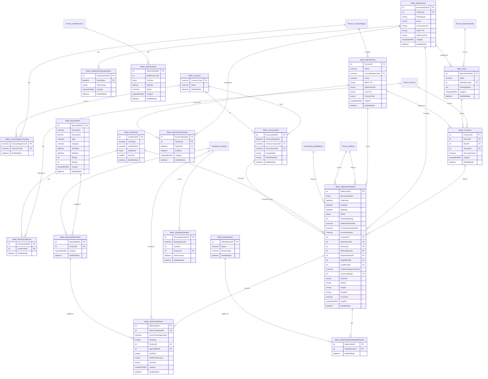
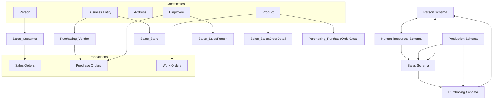

# SQL Database Schema Analysis and Visualization

Based on the database schema retrieved from `#GetDatabaseObjectsMetadata connectionName=P330_AdventureWorks2022`, this document provides a comprehensive analysis and visualization of the AdventureWorks2022 database structure.

## Database Overview

The AdventureWorks2022 database models a fictional bicycle manufacturer with comprehensive business data. It contains:

- **Tables**: Organized across multiple schemas representing different business areas
- **Views**: Providing simplified access to complex data relationships
- **Stored Procedures**: Implementing business logic and data manipulation
- **Functions**: Supporting calculations and data transformations
- **Schemas**: Organizing objects by business function

## Schema Organization

The database uses multiple schemas to organize objects by business function:

- **Person**: Customer and contact information
- **HumanResources**: Employee data and company structure
- **Production**: Products, inventory, and manufacturing
- **Purchasing**: Vendor relationships and purchasing transactions
- **Sales**: Customer orders, sales territories, and marketing
- **dbo**: System objects and miscellaneous functions

## Schema Diagrams

### Human Resources Schema

### Person Schema

### Production Schema

```mermaid
erDiagram
    Production_BillOfMaterials {
        int BillOfMaterialsID PK
        int ProductAssemblyID
        int ComponentID FK
        datetime StartDate
        datetime EndDate
        nvarchar UnitMeasureCode FK
        smallint BOMLevel
        decimal PerAssemblyQty
        datetime ModifiedDate
    }
    Production_Culture {
        nvarchar CultureID PK
        nvarchar Name
        datetime ModifiedDate
    }
    Production_Document {
        hierarchyid DocumentNode PK
        int DocumentLevel
        nvarchar Title
        int Owner
        bit FolderFlag
        nvarchar FileName
        nvarchar FileExtension
        nvarchar Revision
        int ChangeNumber
        tinyint Status
        nvarchar DocumentSummary
        varbinary Document
        uniqueidentifier rowguid
        datetime ModifiedDate
    }
    Production_Illustration {
        int IllustrationID PK
        xml Diagram
        datetime ModifiedDate
    }
    Production_Location {
        smallint LocationID PK
        nvarchar Name
        decimal CostRate
        decimal Availability
        datetime ModifiedDate
    }
    Production_Product {
        int ProductID PK
        nvarchar Name
        nvarchar ProductNumber
        bit MakeFlag
        bit FinishedGoodsFlag
        nvarchar Color
        smallint SafetyStockLevel
        smallint ReorderPoint
        money StandardCost
        money ListPrice
        nvarchar Size
        nvarchar SizeUnitMeasureCode FK
        nvarchar WeightUnitMeasureCode FK
        decimal Weight
        int DaysToManufacture
        nvarchar ProductLine
        nvarchar Class
        nvarchar Style
        int ProductSubcategoryID FK
        int ProductModelID FK
        datetime SellStartDate
        datetime SellEndDate
        datetime DiscontinuedDate
        uniqueidentifier rowguid
        datetime ModifiedDate
    }
    Production_ProductCategory {
        int ProductCategoryID PK
        nvarchar Name
        uniqueidentifier rowguid
        datetime ModifiedDate
    }
    Production_ProductCostHistory {
        int ProductID PK
        datetime StartDate PK
        datetime EndDate
        money StandardCost
        datetime ModifiedDate
    }
    Production_ProductDescription {
        int ProductDescriptionID PK
        nvarchar Description
        uniqueidentifier rowguid
        datetime ModifiedDate
    }
    Production_ProductDocument {
        int ProductID PK
        hierarchyid DocumentNode PK
        datetime ModifiedDate
    }
    Production_ProductInventory {
        int ProductID PK
        smallint LocationID PK
        nvarchar Shelf
        tinyint Bin
        smallint Quantity
        uniqueidentifier rowguid
        datetime ModifiedDate
    }
    Production_ProductListPriceHistory {
        int ProductID PK
        datetime StartDate PK
        datetime EndDate
        money ListPrice
        datetime ModifiedDate
    }
    Production_ProductModel {
        int ProductModelID PK
        nvarchar Name
        xml CatalogDescription
        xml Instructions
        uniqueidentifier rowguid
        datetime ModifiedDate
    }
    Production_ProductModelIllustration {
        int ProductModelID PK
        int IllustrationID PK
        datetime ModifiedDate
    }
    Production_ProductModelProductDescriptionCulture {
        int ProductModelID PK
        int ProductDescriptionID PK
        nvarchar CultureID PK
        datetime ModifiedDate
    }
    Production_ProductPhoto {
        int ProductPhotoID PK
        varbinary ThumbNailPhoto
        nvarchar ThumbnailPhotoFileName
        varbinary LargePhoto
        nvarchar LargePhotoFileName
        datetime ModifiedDate
    }
    Production_ProductProductPhoto {
        int ProductID PK
        int ProductPhotoID PK
        bit Primary
        datetime ModifiedDate
    }
    Production_ProductReview {
        int ProductReviewID PK
        int ProductID
        nvarchar ReviewerName
        datetime ReviewDate
        nvarchar EmailAddress
        int Rating
        nvarchar Comments
        datetime ModifiedDate
    }
    Production_ProductSubcategory {
        int ProductSubcategoryID PK
        int ProductCategoryID FK
        nvarchar Name
        uniqueidentifier rowguid
        datetime ModifiedDate
    }
    Production_ScrapReason {
        smallint ScrapReasonID PK
        nvarchar Name
        datetime ModifiedDate
    }
    Production_TransactionHistory {
        int TransactionID PK
        int ProductID
        int ReferenceOrderID
        int ReferenceOrderLineID
        datetime TransactionDate
        nchar TransactionType
        int Quantity
        money ActualCost
        datetime ModifiedDate
    }
    Production_TransactionHistoryArchive {
        int TransactionID PK
        int ProductID
        int ReferenceOrderID
        int ReferenceOrderLineID
        datetime TransactionDate
        nchar TransactionType
        int Quantity
        money ActualCost
        datetime ModifiedDate
    }
    Production_UnitMeasure {
        nvarchar UnitMeasureCode PK
        nvarchar Name
        datetime ModifiedDate
    }
    Production_WorkOrder {
        int WorkOrderID PK
        int ProductID
        int OrderQty
        int StockedQty
        smallint ScrappedQty
        datetime StartDate
        datetime EndDate
        datetime DueDate
        smallint ScrapReasonID
        datetime ModifiedDate
    }
    Production_WorkOrderRouting {
        int WorkOrderID PK
        int ProductID PK
        smallint OperationSequence PK
        smallint LocationID
        datetime ScheduledStartDate
        datetime ScheduledEndDate
        datetime ActualStartDate
        datetime ActualEndDate
        decimal ActualResourceHrs
        money PlannedCost
        money ActualCost
        datetime ModifiedDate
    }

    Production_Product ||--o{ Production_BillOfMaterials : "is component in"
    Production_Product ||--o{ Production_BillOfMaterials : "is assembly of"
    Production_UnitMeasure ||--o{ Production_BillOfMaterials : "defines"
    Production_UnitMeasure ||--o{ Production_Product : "defines weight"
    Production_UnitMeasure ||--o{ Production_Product : "defines size"
    Production_ProductSubcategory ||--o{ Production_Product : "classifies"
    Production_ProductModel ||--o{ Production_Product : "describes"
    Production_ProductCategory ||--o{ Production_ProductSubcategory : "contains"
    Production_Product ||--o{ Production_ProductCostHistory : "has"
    Production_Product ||--o{ Production_ProductDocument : "has"
    Production_Document ||--o{ Production_ProductDocument : "describes"
    Production_Product ||--o{ Production_ProductInventory : "has"
    Production_Location ||--o{ Production_ProductInventory : "stores"
    Production_Product ||--o{ Production_ProductListPriceHistory : "has"
    Production_ProductModel ||--o{ Production_ProductModelIllustration : "has"
    Production_Illustration ||--o{ Production_ProductModelIllustration : "used in"
    Production_ProductModel ||--o{ Production_ProductModelProductDescriptionCulture : "has"
    Production_ProductDescription ||--o{ Production_ProductModelProductDescriptionCulture : "used in"
    Production_Culture ||--o{ Production_ProductModelProductDescriptionCulture : "used in"
    Production_Product ||--o{ Production_ProductProductPhoto : "has"
    Production_ProductPhoto ||--o{ Production_ProductProductPhoto : "used by"
    Production_Product ||--o{ Production_ProductReview : "has"
    Production_Product ||--o{ Production_TransactionHistory : "has"
    Production_Product ||--o{ Production_TransactionHistoryArchive : "has"
    Production_Product ||--o{ Production_WorkOrder : "produced by"
    Production_WorkOrder ||--o{ Production_WorkOrderRouting : "has"
    Production_Location ||--o{ Production_WorkOrderRouting : "used in"
    Production_ScrapReason ||--o{ Production_WorkOrder : "explains scrap"
```

### Purchasing Schema

### Sales Schema

## Views

The AdventureWorks database contains numerous views that simplify complex data access:

### Human Resources Views

- **vEmployee**: Complete employee information
- **vEmployeeDepartment**: Employees with department details
- **vEmployeeDepartmentHistory**: Historical department assignments
- **vJobCandidate**: Job candidate information with resume details
- **vJobCandidateEducation**: Education history from candidate resumes
- **vJobCandidateEmployment**: Employment history from candidate resumes

### Person Views

- **vAdditionalContactInfo**: Extended contact information
- **vStateProvinceCountryRegion**: State and country information

### Production Views

- **vProductAndDescription**: Products with localized descriptions
- **vProductModelCatalogDescription**: Product model catalog information
- **vProductModelInstructions**: Manufacturing instructions for products

### Sales Views

- **vIndividualCustomer**: Customer information for individuals
- **vPersonDemographics**: Customer demographic information
- **vSalesPerson**: Sales staff information with territories
- **vSalesPersonSalesByFiscalYears**: Sales performance by fiscal year
- **vStoreWithDemographics**: Store information with demographics
- **vStoreWithContacts**: Store information with contact details
- **vStoreWithAddresses**: Store information with address details

## Stored Procedures

The database contains stored procedures for various business operations:

### Human Resources Procedures

- **uspUpdateEmployeeHireInfo**: Updates employee hire information
- **uspUpdateEmployeeLogin**: Updates employee login information
- **uspUpdateEmployeePersonalInfo**: Updates employee personal details

### Database Management Procedures

- **uspPrintError**: Prints error information
- **uspLogError**: Logs error details
- **uspGetWhereUsedProductID**: Finds where a product is used
- **uspGetManagerEmployees**: Gets employees reporting to a manager
- **uspGetEmployeeManagers**: Gets managers for an employee
- **uspGetBillOfMaterials**: Retrieves bill of materials for a product

### Sales Procedures

- **uspGetOrderTrackingBySalesOrderID**: Tracks order status

## Functions

The database includes various functions for calculations and data transformation:

### Scalar Functions

- **ufnGetAccountingEndDate**: Calculates accounting period end date
- **ufnGetAccountingStartDate**: Calculates accounting period start date
- **ufnGetProductDealerPrice**: Determines dealer price for a product
- **ufnGetProductListPrice**: Gets list price for a product on a date
- **ufnGetProductStandardCost**: Gets standard cost for a product on a date
- **ufnGetStock**: Gets current inventory level for a product
- **ufnGetDocumentStatusText**: Converts document status code to text
- **ufnGetPurchaseOrderStatusText**: Converts purchase order status to text
- **ufnGetSalesOrderStatusText**: Converts sales order status to text

### Table-Valued Functions

- **ufnGetContactInformation**: Returns contact information for a person
- **ufnGetCustomerInformation**: Returns customer information

## Data Flow Diagram

## Key Insights

1. **Comprehensive Business Model**: The AdventureWorks database models a complete business operation from manufacturing to sales, with interconnected schemas representing different business areas.

2. **Rich Customer Data**: The Person schema maintains detailed customer information, supporting both individual and store customers.

3. **Production Tracking**: The Production schema contains comprehensive product data, including bill of materials, inventory tracking, and work orders.

4. **Sales Pipeline**: The Sales schema tracks everything from shopping carts to completed orders, with support for special offers and sales territories.

5. **Human Resources Management**: The HR schema manages employee data, department structure, and job candidates.

6. **Multi-currency Support**: Built-in support for different currencies and exchange rates for international business.

7. **Territorial Organization**: Sales are organized by territories with historical tracking of sales performance.

8. **Vendor Management**: The Purchasing schema handles vendor relationships and purchase orders.

The AdventureWorks database provides a realistic model of a mid-sized manufacturing company's data structure, with proper normalization and relationships across multiple business domains.
