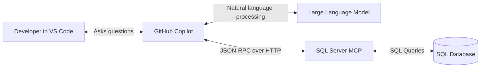
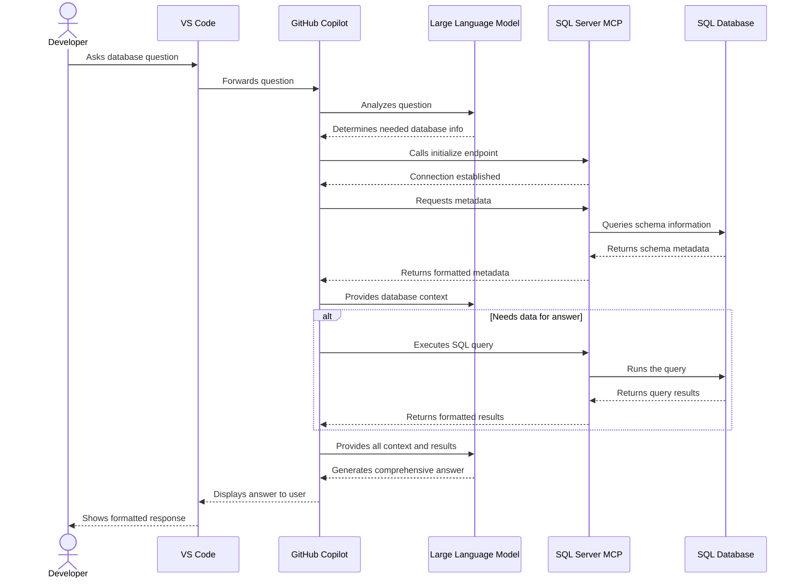
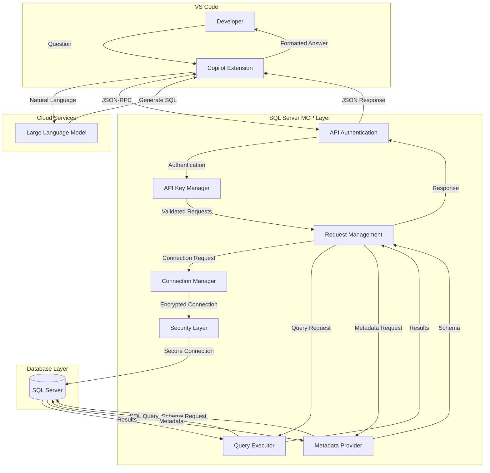
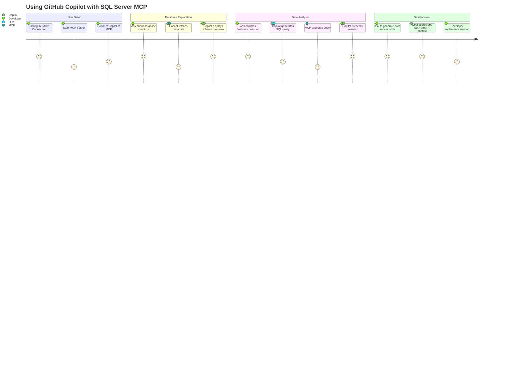
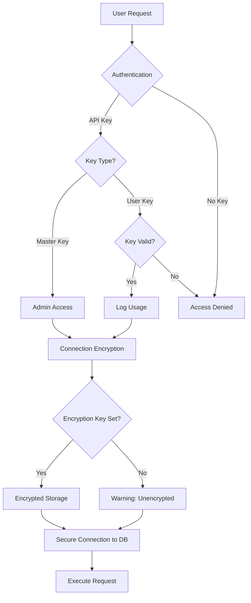

# GitHub Copilot's Integration with MCP Server and LLMs

GitHub Copilot creates a powerful AI-assisted development experience by orchestrating communication between three key components:

1. **The Developer (via VS Code)**
2. **The Model Context Protocol (MCP) Server**
3. **Large Language Models (LLMs)**

Let me explain this interaction with visualizations to make it clear.

## The Communication Flow

## Detailed Sequence of Operations

## Model Context Protocol Data Flow

## User Journey Example

## How It Works Behind the Scenes

When you interact with GitHub Copilot in VS Code while connected to an SQL Server MCP server:

1. **Initialization Phase:**

   - Copilot connects to the MCP server using the URL and API key in the mcp.json configuration
   - MCP server authenticates the request using either the master key or a user-specific API key
   - Authentication middleware validates the API key and logs usage information
   - MCP server establishes a session after successful authentication

2. **Context Building:**

   - Copilot uses the LLM to understand your natural language question
   - It determines what database information is needed to answer your question
   - It calls appropriate MCP methods to gather that information

3. **Data Retrieval:**

   - The MCP server handles requests for database metadata or query execution
   - It connects to your SQL Server using the configured connections
   - It securely retrieves the requested information
   - Data is transformed into a standardized format and returned to Copilot

4. **Answer Generation:**
   - Copilot sends all relevant database context to the LLM
   - The LLM generates a comprehensive answer, including explanations, code, and visualizations
   - The response is formatted and displayed in VS Code

This integration allows GitHub Copilot to be "database-aware" - providing answers that are specific to your actual database schema and data, rather than generic responses based only on its training data.

## Security Considerations

The SQL Server MCP implements several security layers:

- Multi-key authentication system with master and user-specific API keys
- API key management with usage logging and expiration
- Connection string encryption at rest with AES-256
- Secure communication with the database
- Parameterized queries to prevent SQL injection

This multi-layered security approach ensures your database connections and credentials remain protected throughout the interaction between Copilot, the MCP server, and your SQL databases.
