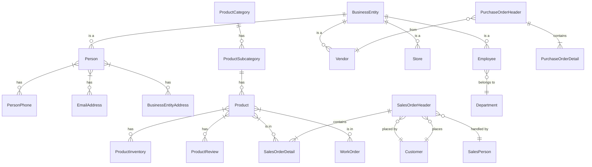
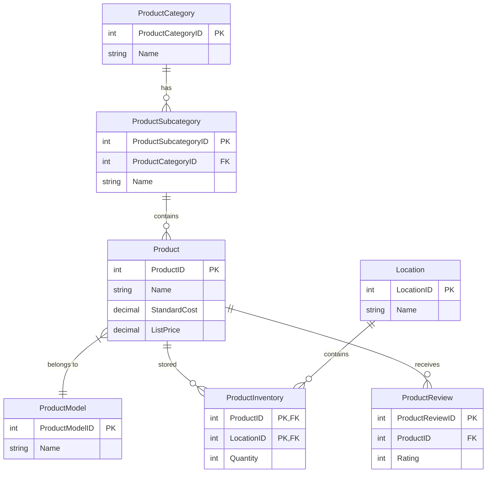
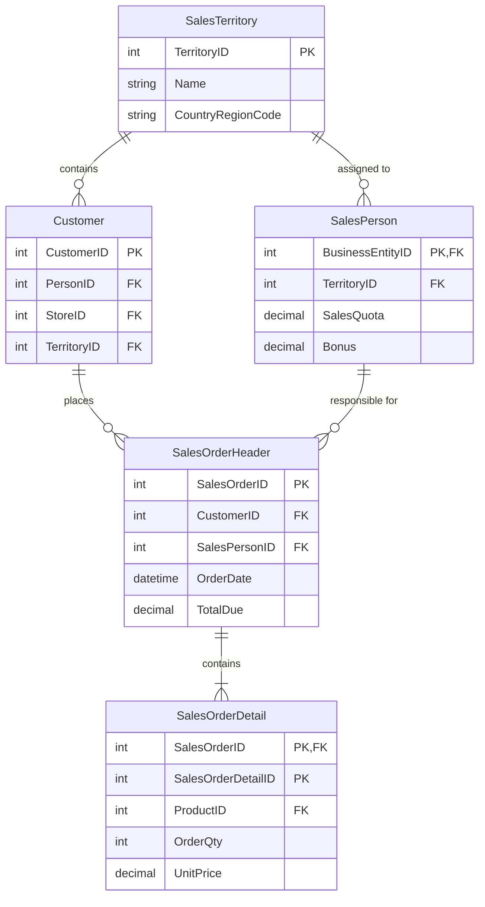
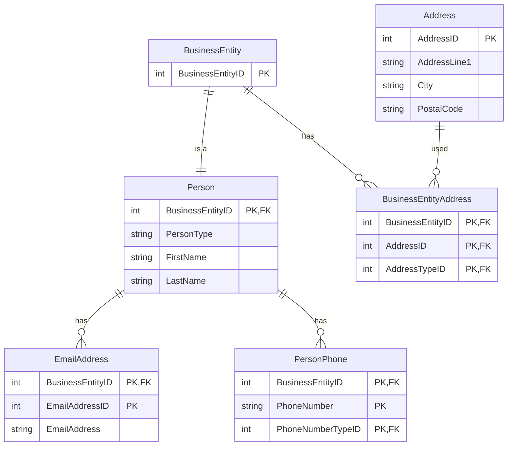
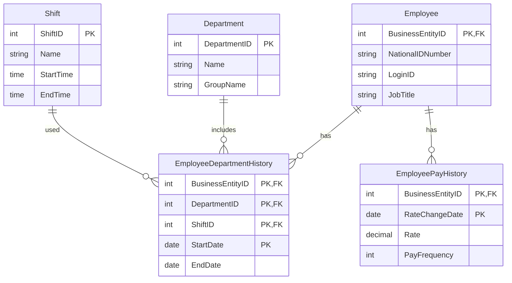
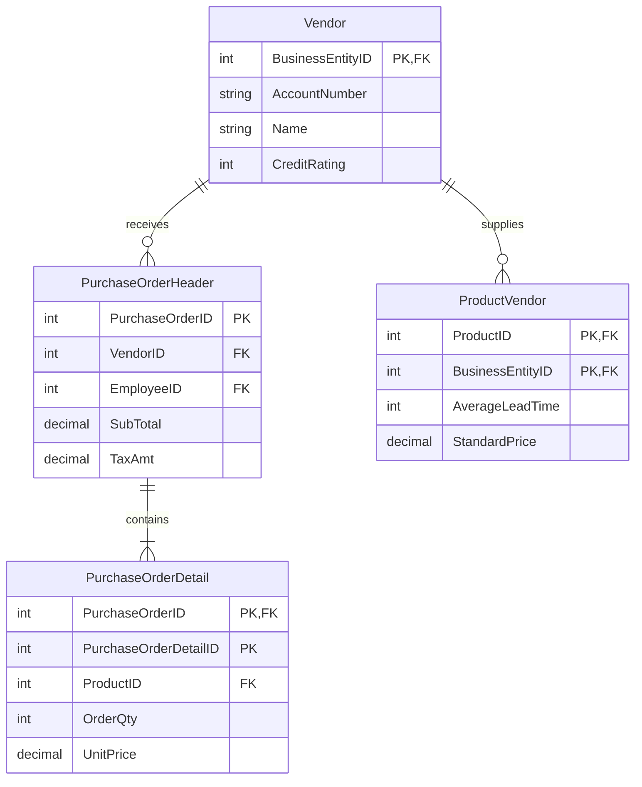

# Quick Installation

## The Quickest Way to use mssqlMCP

Just use the docker image `mcprunner/mssqlmcp` [Docker Hub Instructions](/Documentation/DockerHub.md)

## Install Tasks

1. Checkout code from [https://github.com/mcprunner/mssqlMCP.git](https://github.com/mcprunner/mssqlMCP.git)
2. Decide on an encryption key `MSSQL_MCP_KEY` or type `string` and save somewhere. This string will be used to encrypt the connections saved in the interal sqlite database. You can use [Scripts/Generate-MCP-Key.ps1](/Scripts/Generate-MCP-Key.ps1) to create one.
3. In a powershell session, set the MSSQL_MCP_KEY variable to your encryption key.
4. Generate the API key `MSSQL_MCP_API_KEY` using [Scripts/Set-Api-Key.ps1](/Scripts/Set-Api-Key.ps1) and save somewhere.
5. In the same powershell session, set the `MSSQL_MCP_API_KEY` variable to your API key.
6. Start the MCP Server in that powershell session by running [Scripts\Start-MCP-Encrypted.ps1](/Scripts/Start-MCP-Encrypted.ps1)
7. Setup Visual Studio Code to conenct to your MCP by creating a .vscode directory under this project root directory, and `copy Scripts\mcp.json .vscode\`
8. In VSCode option the .vscode\mcp.json and you should see a `Start` link right above the `sql-server-mcp` definition. Run Start, and cut-n-paste in the `MSSQL_MCP_KEY` when prompted.

### Example of setting variables and running mssqlMCP

```powershell

$env:MSSQL_MCP_KEY = "abcd1234567891-UseSomethingElseForYourMCPKey="
$env:MSSQL_MCP_API_KEY = "efghij1234567891-UseSomethingElseForYourAPIKey="

# Start the MCP Server
Scripts\Start-MCP-Encrypted.ps1
# or just dotnet run from the root of the project
dotnet run
```

### Adding your first SQL Server Database connection

In your VSCode Github Copilot chat window, select Agent mode, and enter the following in the chat window:

```prompt

#AddConnection ConnectionName="localhost_AdventureWorks2019" ConnectionString="Server=localhost;Database=AdventureWorks2019;Trusted_Connection=True;TrustServerCertificate=True;" Description="My Demo AdventureWorks2019 database"

```

You will be prompted with a "Continue" button. Once pressed, your connection will be added assuming the database is setup to allow that conenction string to connect.

## Installation Complete - Examples of Usage.

### Listing your first connection(s)

In your VSCode Github Copilot chat window, select Agent mode, and enter the following in the chat window:

```prompt

#ListConnections

```

Expect the following type of response

#### SQL Server MCP Connections

Here's a list of your current SQL Server connections:

| Name                         | Description                         | Server Type | Last Used           | Created On          |
| ---------------------------- | ----------------------------------- | ----------- | ------------------- | ------------------- |
| Server1_AdventureWorks2022   | Adventure Works 2022 Demo Database  | SqlServer   | 2025-05-17 18:25:59 | 2025-05-17 13:53:44 |
| Server1_master               | Default master database connection  | SqlServer   | -                   | 2025-05-17 00:16:40 |
| PROTO                        | Prototype database                  | SqlServer   | -                   | 2025-05-17 00:14:35 |
| localhost_AdventureWorks2019 | My Demo AdventureWorks2019 database | SqlServer   | -                   | 2025-05-18 15:24:29 |

You have 4 SQL Server connections configured in your MCP server. The most recently used connection is Server1_AdventureWorks2022, and your newest connection is localhost_AdventureWorks2019 which was just added today.

###### What you can do with these connections:

```
# Test a specific connection
#TestConnection ConnectionName="localhost_AdventureWorks2019"

# Get database metadata
#GetDatabaseObjectsMetadata connectionName="localhost_AdventureWorks2019"

# Get specific object types
#GetDatabaseObjectsMetadata connectionName="localhost_AdventureWorks2019" objectType=TABLE
#GetDatabaseObjectsMetadata connectionName="localhost_AdventureWorks2019" objectType=VIEW
#GetDatabaseObjectsMetadata connectionName="localhost_AdventureWorks2019" objectType=PROCEDURE
```

## More of what you can do

```
# In `Ask Mode` Summerize my database

[Prompt]
Using all results from #GetDatabaseObjectsMetadata connectionName="localhost_AdventureWorks2019", give me a high level summary of my database and include mermaid graphs for all SQL objects.

```

### Response Below

# AdventureWorks2019 Database Summary

I'll analyze your AdventureWorks2019 database and provide a high-level overview with visual representations of the database structure.

## Database Overview

The AdventureWorks2019 database is a sample database developed by Microsoft that models a fictional bicycle manufacturing company. The database consists of:

- **71 Tables** organized into 5 main schemas
- **20 Views** for simplified data access
- **26 Stored Procedures** for encapsulated business logic
- **12 User-Defined Functions** for specialized operations
- **4 User-Defined Types** for custom data types

## Schema Organization

The database is organized into the following schemas:

| Schema         | Description                          | Tables | Views | Procedures |
| -------------- | ------------------------------------ | ------ | ----- | ---------- |
| Person         | Customer and contact information     | 9      | 3     | 3          |
| HumanResources | Employee and department data         | 9      | 6     | 4          |
| Production     | Product, inventory and manufacturing | 24     | 5     | 5          |
| Purchasing     | Vendor and purchase order data       | 5      | 2     | 5          |
| Sales          | Customer, order, and sales data      | 19     | 4     | 9          |

## Key Table Relationships



## Production Schema



## Sales Schema



## Person Schema



## HumanResources Schema



## Purchasing Schema



## Key Views

The database contains several useful views including:

1. `vEmployee` - Comprehensive employee information
2. `vSalesPerson` - Sales personnel with their territories and quotas
3. `vProductAndDescription` - Products with multilanguage descriptions
4. `vPersonDemographics` - Extended person demographics
5. `vSalesOrderDetail` - Detailed sales order information

## Stored Procedures

The database includes procedures for:

- Employee management (`uspUpdateEmployeeHireInfo`, `uspUpdateEmployeePersonalInfo`)
- Password management (`uspLogError`, `uspPrintError`)
- Sales operations (`uspGetBillOfMaterials`, `uspGetWhereUsedProductID`)

## Summary

The AdventureWorks2019 database is a comprehensive relational database that models a bicycle manufacturing business with interconnected schemas for human resources, sales, purchasing, production, and person data. The well-structured design with normalized tables, supporting views, and stored procedures provides a realistic enterprise database model.

## Running with Docker

### Building the Docker Image

```bash
docker build -t mssqlmcp:latest .
```
