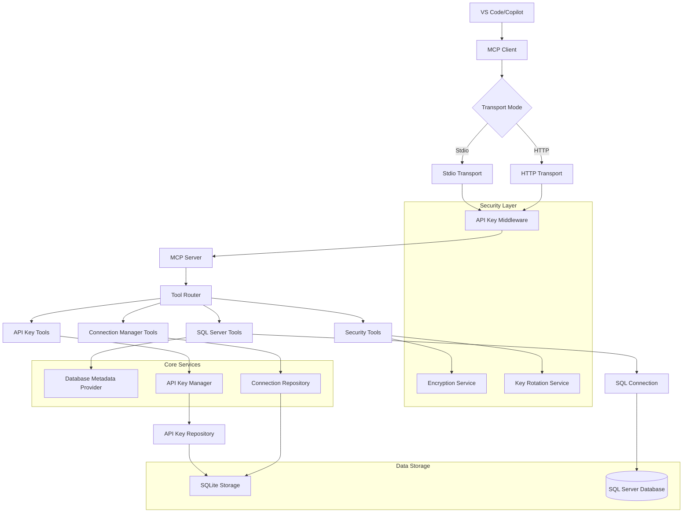

# mssqlMCP Release Documentation (1.0.1.2)

**Release Date:** August 12, 2025  
**Current Branch:** documentation.2  
**Release Branch:** origin/main

## Summary of Changes

This release represents the comprehensive documentation branch (documentation.2) for the mssqlMCP project, a Model Context Protocol (MCP) Server that provides SQL Server database connectivity for VS Code and Copilot integration.

## Application Overview

**Application Name:** mssqlMCP  
**Version:** 1.0.1.2  
**Project File:** mssqlMCP.csproj  
**Repository:** MCPRUNNER/mssqlMCP

## Core Features

### 🔧 **MCP Server Tools**

- **SQL Server Integration:** Complete SQL Server database connectivity via MCP protocol
- **Dual Transport Support:** Both HTTP and Stdio transport modes
- **Connection Management:** Secure connection string storage and management
- **Database Metadata:** Comprehensive schema, table, and object metadata retrieval
- **SQL Server Agent Support:** Job monitoring and management capabilities
- **SSIS Catalog Integration:** Package and project deployment model support
- **Azure DevOps Analytics:** Integration with Azure DevOps databases

### 🔐 **Security Features**

- **Multi-Key API Authentication:** Support for both master keys and user-specific API keys
- **Connection String Encryption:** Secure storage with encryption key rotation
- **Input Validation:** Comprehensive validation framework for all inputs
- **SQL Injection Protection:** Built-in protection against malicious queries

### 🛠 **Tool Categories**

#### Core SQL Server Tools

- `mssql_initialize_connection` - Establish SQL Server connections
- `mssql_execute_query` - Execute SQL queries with JSON results
- `mssql_get_table_metadata` - Retrieve detailed table schemas
- `mssql_get_database_objects_metadata` - Get comprehensive database object information
- `mssql_get_database_objects_by_type` - Filter objects by type (tables, views, procedures, functions)

#### Specialized Metadata Tools

- `mssql_get_agent_jobs` - SQL Server Agent job information
- `mssql_get_agent_job_details` - Detailed job steps, schedules, and history
- `mssql_get_ssis_catalog_info` - SSIS catalog and package information
- `mssql_get_azure_devops_info` - Azure DevOps analytics and metrics

#### Connection Management Tools

- `mssql_list_connections` - View all available connections
- `mssql_add_connection` - Add new database connections
- `mssql_update_connection` - Modify existing connections
- `mssql_remove_connection` - Delete connections
- `mssql_test_connection` - Validate connection strings

#### Security Tools

- `mssql_generate_key` - Create encryption keys
- `mssql_migrate_connections` - Upgrade to encrypted storage
- `mssql_rotate_key` - Rotate encryption keys safely

#### API Key Management Tools

- `mssql_create_key` - Generate new API keys for users
- `mssql_list_user_keys` - View user's API keys
- `mssql_list_all_keys` - Admin view of all keys
- `mssql_revoke_key` - Disable API keys
- `mssql_delete_key` - Remove API keys
- `mssql_get_key_usage_logs` - Usage analytics for specific API keys
- `mssql_get_user_usage_logs` - Usage analytics for users

## Architecture Overview



## Technical Implementation

### Core Components

1. **Program.cs** - Application entry point with service configuration
2. **SqlServerTools.cs** - Main MCP tool implementation for database operations
3. **ConnectionManagerTool.cs** - Connection lifecycle management
4. **SecurityTool.cs** - Encryption and security operations
5. **ApiKeyManagementTool.cs** - API key lifecycle management

### Service Architecture

- **ConnectionStringProvider** - Legacy connection string management
- **ConnectionManager** - Modern connection management with encryption
- **DatabaseMetadataProvider** - SQL Server metadata extraction
- **EncryptionService** - Connection string encryption/decryption
- **ApiKeyManager** - API key authentication and management

### Validation Framework

- **InputValidator** - Comprehensive input validation
- **ValidationExtensions** - Helper methods for validation workflows
- **Security Patterns** - SQL injection prevention and dangerous keyword detection

## Installation Instructions

### Prerequisites

- .NET 8.0 or later
- SQL Server access
- VS Code with Copilot extension

### Configuration

1. **Environment Variables:**

   ```bash
   MSSQL_MCP_TRANSPORT=Http  # or Stdio
   MSSQL_MCP_API_KEY=your-master-api-key
   MSSQL_MCP_KEY=your-encryption-key
   ```

2. **Connection Strings:**

   - Configure in `appsettings.json` or
   - Use the connection management tools to add encrypted connections

3. **MCP Configuration:**
   ```json
   {
     "mcpServers": {
       "mssqlMCP": {
         "command": "dotnet",
         "args": ["run", "--project", "path/to/mssqlMCP.csproj"],
         "env": {
           "MSSQL_MCP_TRANSPORT": "Stdio"
         }
       }
     }
   }
   ```

### Build and Run

```bash
# Build the project
dotnet build

# Run in HTTP mode
MSSQL_MCP_TRANSPORT=Http dotnet run

# Run in Stdio mode for MCP
MSSQL_MCP_TRANSPORT=Stdio dotnet run
```

## Usage Examples

### Via MCP Client

```csharp
// Initialize connection
await client.CallToolAsync("mssql_initialize_connection", new { connectionName = "MyConnection" });

// Execute query
var result = await client.CallToolAsync("mssql_execute_query", new { query = "SELECT COUNT(*) FROM Users", connectionName = "MyConnection" });

// Get metadata
var tables = await client.CallToolAsync("mssql_get_table_metadata", new { connectionName = "MyConnection", schema = "dbo" });
```

### Via HTTP API

```bash
curl -X POST http://localhost:3001/mcp \
  -H "Authorization: Bearer your-api-key" \
  -H "Content-Type: application/json" \
  -d '{"jsonrpc":"2.0","id":"1","method":"tools/call","params":{"name":"mssql_execute_query","arguments":{"query":"SELECT @@VERSION","connectionName":"DefaultConnection"}}}'
```

## Known Issues

1. **Performance:** Large schema metadata retrieval may timeout on very large databases
2. **Permissions:** Some specialized tools require elevated SQL Server permissions
3. **Transport Mode:** Stdio mode requires proper MCP client configuration

## Breaking Changes

None in this release - this is primarily a documentation and stability update.

## Deprecated Features

None in this release.

## Security Considerations

- Always use encrypted connection strings in production
- Regularly rotate API keys and encryption keys
- Limit SQL Server permissions to minimum required
- Monitor API key usage logs for suspicious activity

## Support

For issues and questions:

- GitHub Issues: MCPRUNNER/mssqlMCP
- Documentation: See `/Documentation` folder
- Examples: See `/Examples` folder

---

_This release document was generated automatically using GitVisionMCP tools on August 12, 2025_
